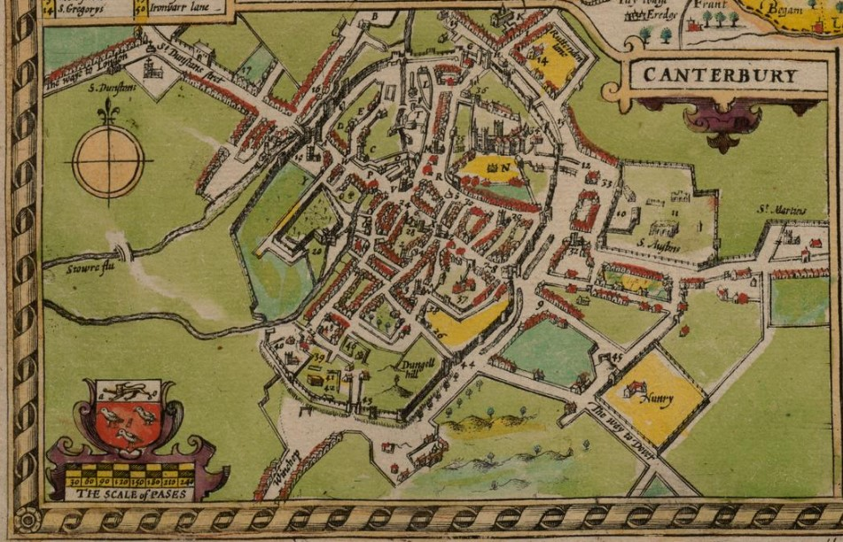
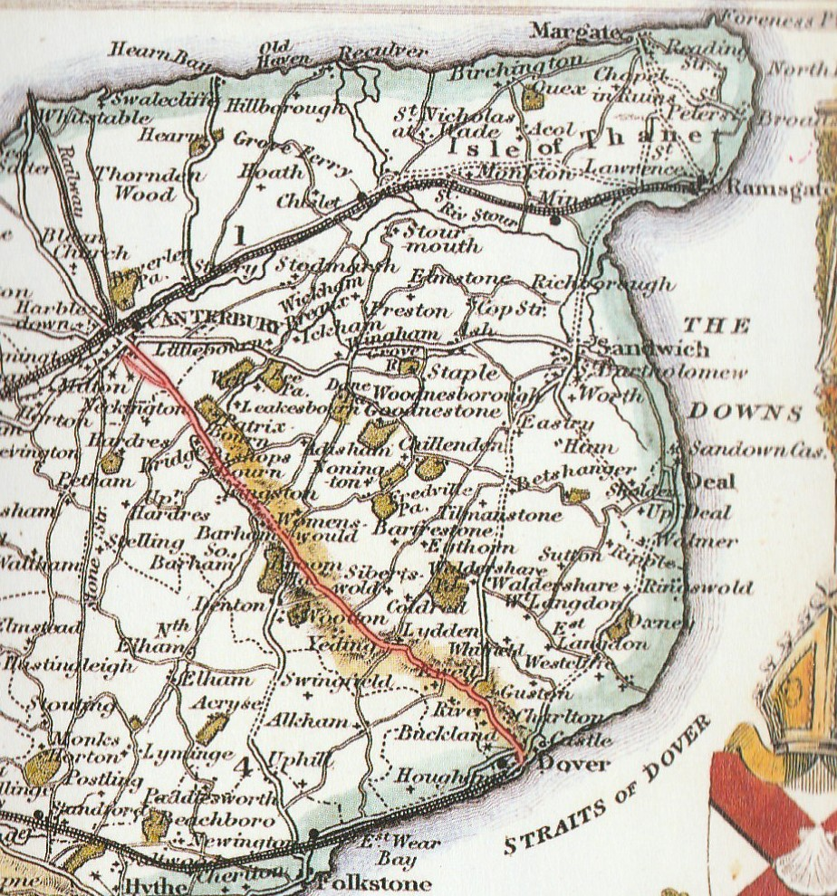
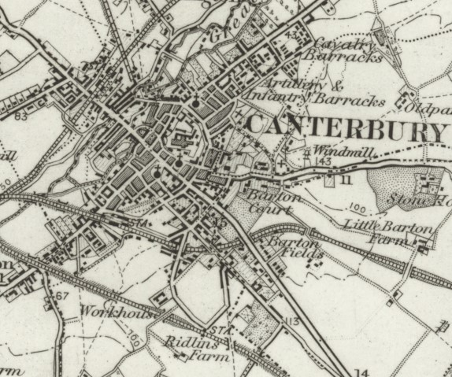

# Mapping the Dover Road: David Copperfield’s journey. 

by Elizabeth Waterman-Scrase'''

David Copperfield gives his readers a detailed itinerary [David Copperfield Curated walk](/david-copperfield-curated-walk). But what do we really know about the conditions he would have faced?

This part of the Dover Road has been established for quite some time; a well-travelled route it carried trade and workers from the coast to the cities on route to London. To develop a sense of its age, direction, and personality the first point of reference might be maps. 

   
  .

John Speed's England : a coloured facsimile of the maps and text from the theatre of the Empire of Great Britaine, first edition, 1611 / Pt. 2, Kent, Sussex, Surrey, Berkshire, Middlesex, Essex, Suffolk, Norfolk, Hertfordshire, Buckinghamshire. John Arlott, ed. Pheonix, 1953.
 

   
  .

Moule's County Maps: the East and South-East of England. Bracken Books, 1994.

   
  .

O.S. map of Kent 1873. Reproduced with the permission of the National Library of Scotland.

Speed’s map shows the road’s journey out from the city of [[Canterbury]] - ''the way to Dover'' is clearly marked running past a nunnery which now marks the start of the New [[Dover]] Road in parallel with the old route, as seen on the 1873 O.S map. Moule’s map clearly marks this and the route to [[Dover]]. It is interesting to note, David’s journey seems relatively quiet compared to what it would be day. The towns, villages and settlements are largely intact today and this was a main route from the coast (population was considerably smaller in the 1850s, but this road might have had more traffic than he suggests). So, it is relatively easy to trace the steps of Copperfield today. These maps also show the land around and with further archaeological evidence we can note the crops and type of farming that took place along the [[Dover]] Road. It is with these components that a picture can be built. What did it smell like on that journey? Why did Copperfield turn up at his aunt’s house dusty, with destroyed shoes? 

The differing environments David would have come across, that are indeed mentioned in the book, can be verified. The area around [[Canterbury]] was a mix of hop farms and orchards of cherry and apple, surrounded by forest and woodlands. As Copperfield travels towards [[Dover]], the land changes, and thus, the crops and farming methods. Barley and arable crops become more common, as do the quantity of sheep and cattle farms, the open fields would certainly have had a quite different scent compared to the heady aromas of hop and orchard, more sheep pooh and barley. As Copperfield gets closer to [[Dover]] the smell of the sea would be taking hold. It is worth noting that although horses featured prominently in everyday life during the 1850s, it is likely that a person might be ‘nose-blind’ to that smell, much as we are in the early 21st century to car fumes. A sudden change in aroma is what takes our attention. As we follow David’s progress what exactly is that we are starting to smell? Surely it’s familiar? That’s it. [Leather and dust](19c-leather-and-dust).
